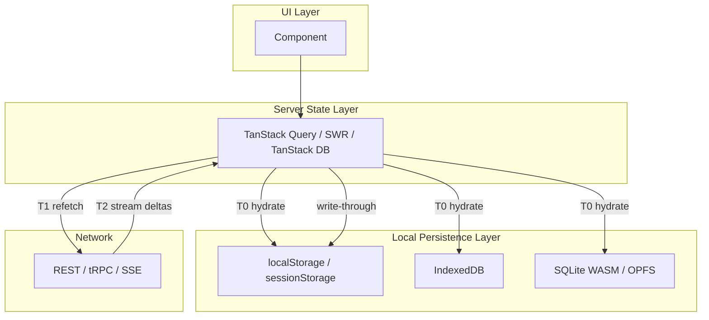
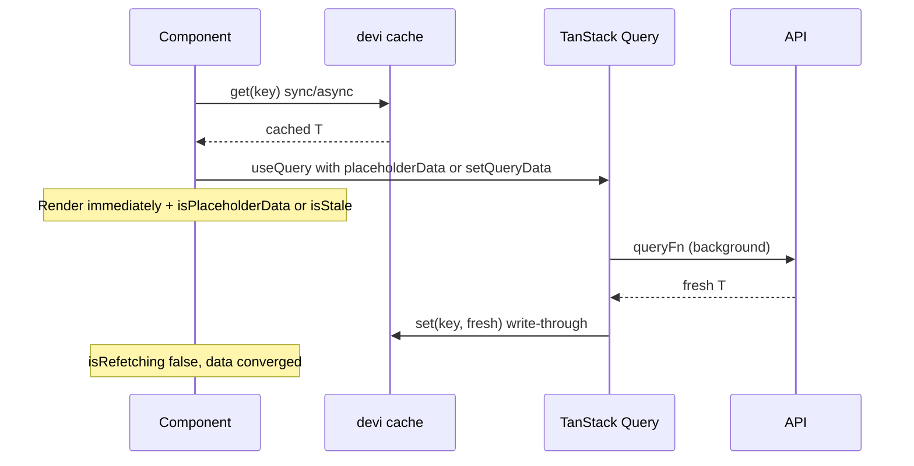

# Prefetching & Data Streaming in TypeScript Frontend Applications

Research synthesis for **local-first render → background/stream refresh → clear freshness UI**, with emphasis on TypeScript frontends, the T3 ecosystem, and mapping to the **devi** on-device cache library.

**devi is designed to sit under [@tanstack/react-query](https://tanstack.com/query)** (TanStack Query, formerly React Query): Query owns orchestration; devi owns durable T0 storage. See [README](../README.md#tanstack-query-integration) for the canonical `useQuery` integration.

---

## 1. The target UX (what “extremely responsive” actually means)

Production apps that feel “auto-loaded” usually implement a **three-phase data lifecycle**, not a single `fetch()`:

| Phase | Source | User sees | Network |
|-------|--------|-----------|---------|
| **T0 – Instant** | Memory, persisted cache, SQLite, `localStorage` | Full UI with last-known data | None |
| **T1 – Revalidate** | REST/tRPC/GraphQL in background | Same UI + subtle “refreshing” | One request (deduped) |
| **T2 – Converge** | Server truth wins | UI updates; indicator clears | Done |

That is **stale-while-revalidate (SWR)** with an explicit **freshness contract**: data may be briefly stale, but the UI never lies about whether it is showing cache vs live data.

**Key distinction (TanStack Query):**

- **`status`** → “Do we have displayable data?” (`pending` | `success` | `error`)
- **`fetchStatus` / `isFetching` / `isRefetching`** → “Is a request in flight?” (includes background refetch)

Use **`isPending`** (or `status === 'pending'`) for empty-state skeletons, and **`isRefetching`** (or `isFetching && !isPending`) for “updating from server” indicators while old data stays on screen.

**References:**

- [Background Fetching Indicators](https://tanstack.com/query/latest/docs/framework/react/guides/background-fetching-indicators)
- [useQuery reference](https://tanstack.com/query/latest/docs/framework/react/reference/useQuery)

---

## 2. Architecture: two layers, not one

Most mature TS apps split responsibilities:



| Layer | Responsibility | Examples |
|-------|----------------|----------|
| **Local persistence** | Survive reloads; fast sync read | devi, `persistQueryClient`, SWR `provider` |
| **Server-state cache** | Dedup, staleTime, background refetch, optimistic writes | TanStack Query, SWR, TanStack DB |
| **Streaming transport** | Incremental tokens/events (AI, live feeds) | SSE, `ReadableStream`, tRPC subscriptions |

**devi role:** optimistic on-device cache + streaming (planned) — industry pattern is **devi = T0 store**, **Query = orchestration**, **stream = T2 for long/incremental payloads**.

---

## 3. T3 / create-t3-turbo: how they fetch data

The [create-t3-turbo](https://github.com/t3-oss/create-t3-turbo) monorepo (Next.js, Expo, TanStack Start, shared `packages/api` tRPC) centers on **typesafe APIs + TanStack Query**, not a custom cache library.

### Server prefetch + client hydration (RSC path)

Recommended pattern ([t3-oss/create-t3-turbo#876](https://github.com/t3-oss/create-t3-turbo/issues/876)):

1. In a **Server Component**, create server-side tRPC helpers.
2. **`await api.post.all.prefetch()`** — populate server `QueryClient`.
3. **`dehydrate(queryClient)`** → pass to **`<HydrationBoundary>`**.
4. Client **`useQuery`** reads warm cache immediately.
5. Often **`refetchOnMount: false`** when RSC already supplied fresh server data (avoids double-fetch).

```tsx
// Pattern from T3 discussions — conceptual
await api.post.all.prefetch();
const dehydratedState = dehydrate(api.queryClient);

return (
  <HydrationBoundary state={dehydratedState}>
    <PostList />
  </HydrationBoundary>
);
```

**Why not pass props from RSC?** Hydration keeps one cache model on the client, enables invalidation/mutations, and avoids duplicating “server props vs client cache” sources of truth.

### Router-level prefetch (TanStack Router / Start)

[TanStack Query prefetching guide](https://tanstack.com/query/latest/docs/framework/react/guides/prefetching):

- **`await prefetchQuery(critical)`** — block route until must-have data exists.
- **`prefetchQuery(secondary)`** without await — render shell, secondary data streams in.

### Expo / mobile in T3

Same tRPC + Query stack; persistence often uses **AsyncStorage persister** instead of `localStorage` — same mental model, different adapter.

---

## 4. TanStack Query (`@tanstack/react-query`): orchestration on top of devi

TanStack Query is the **recommended orchestrator** for apps using devi. It is not a replacement for devi — it solves a different problem:

| Concern | TanStack Query | devi |
|---------|----------------|------|
| In-memory server-state graph | Yes | No |
| Request dedup / `staleTime` / refetch | Yes | No |
| Survives tab reload / offline disk | Via `persistQueryClient` (optional) | Yes (primary) |
| Platform storage (SQLite, OPFS, Expo) | Adapters only | Yes (core) |

### Canonical devi + Query integration

```ts
import { useQuery } from '@tanstack/react-query';
import { read, CacheFactory } from 'devi-cache';

const cache = CacheFactory.create<Post>('async', platform);

// Orchestrator owns the lifecycle; devi is T0 storage
useQuery({
  queryKey: ['post', id],
  placeholderData: () => read(cache, `post:${id}`),
  queryFn: async () => {
    const fresh = await api.getPost(id);
    await cache.set(`post:${id}`, fresh);
    return fresh;
  },
});
```

- **`placeholderData`** — instant render from devi; sets `isPlaceholderData: true` until the API responds.
- **`queryFn` write-through** — fresh server data is persisted back to devi for the next session.
- Pair with **`isRefetching`** for a background refresh indicator (see §4.D).

Related packages: `@tanstack/react-query-persist-client`, `@tanstack/query-sync-storage-persister` (optional second persistence path alongside devi).

### A. Seed cache from local storage (imperative, sync)

```ts
queryClient.setQueryData(['user', id], cachedUser);
```

Docs: [`setQueryData` vs `fetchQuery`](https://tanstack.com/query/latest/docs/reference/QueryClient) — use `setQueryData` when data is **synchronously** available; use `fetchQuery` when you must await network.

### B. `placeholderData` vs `initialData` (critical)

| Option | Persisted? | Use for |
|--------|------------|---------|
| **`placeholderData`** | No | Partial/preview/local snapshot while fetching |
| **`initialData`** | Yes (becomes cache) | SSR hydration, truly trusted bootstrap |

From [Placeholder Query Data](https://tanstack.com/query/latest/docs/framework/react/guides/placeholder-query-data): with `placeholderData`, query starts in **`success`** with **`isPlaceholderData: true`**.

```ts
useQuery({
  queryKey: ['post', id],
  queryFn: () => fetchPost(id),
  placeholderData: () => read(cache, `post:${id}`),
});
```

Prefer the full write-through pattern in the [canonical integration](#canonical-devi--query-integration) when using devi as T0 storage.

### C. Persist entire Query cache

[`persistQueryClient`](https://tanstack.com/query/latest/docs/framework/react/plugins/persistQueryClient) + `PersistQueryClientProvider`:

- Restores dehydrated cache on startup.
- Throttled writes to `localStorage` / IndexedDB.
- Set **`gcTime` ≥ `maxAge`** or use `Infinity`.

### D. Background refresh UI

```tsx
{isRefetching && <RefreshIndicator />}
{data && <Content data={data} />}
```

Global: **`useIsFetching()`** for app-wide subtle bar.

### E. Prefetch for navigation

Hover/route `prefetchQuery` with `staleTime` — [prefetching example](https://tanstack.com/query/latest/docs/framework/react/examples/prefetching).

### F. Optimistic mutations

`onMutate` → `setQueryData` → rollback on error → `invalidateQueries` on settle.

---

## 5. SWR (Vercel): same philosophy, different API

[SWR API](https://swr.vercel.app/docs/api):

- **`fallbackData` / `fallback`** — immediate render; not counted as “loaded” (`isLoading` still works).
- **`isValidating`** — any revalidation in flight.
- **`keepPreviousData`** — key changes without blanking UI.
- **Custom `provider`** — [localStorage-backed Map](https://swr.vercel.app/docs/advanced/cache).

**devi mapping:** `get()` → `fallback`/`provider` seed; TTL → when `revalidateIfStale` should fire.

---

## 6. Local storage tiers (SQLite vs KV stores)

| Store | Latency | Size | Best for |
|-------|---------|------|----------|
| **Memory / Query cache** | μs | RAM-bound | Session hot data |
| **sessionStorage** | sync, tab-scoped | ~5MB | Ephemeral UI state |
| **localStorage** | sync | ~5MB | Small JSON entities |
| **IndexedDB** | async | Much larger | Lists, offline queues |
| **SQLite WASM + OPFS** | worker, SQL | Large relational | Local-first, complex queries |

**Notable OSS:**

- [sqlocal](https://github.com/DallasHoff/sqlocal) — SQLite in worker, OPFS (needs COOP/COEP).
- [SQLite WASM + OPFS](https://developer.chrome.com/blog/sqlite-wasm-in-the-browser-backed-by-the-origin-private-file-system)
- [PGlite](https://github.com/electric-sql/pglite) + [Electric sync](https://electric.ax/sync/pglite)
- [Offline-first frontends 2025 (LogRocket)](https://blog.logrocket.com/offline-first-frontend-apps-2025-indexeddb-sqlite/)

---

## 7. TanStack DB (2025–2026): local-first at the next level

[TanStack DB overview](https://tanstack.com/db/latest/docs/overview):

- Normalized collections + live queries (sub-ms incremental updates).
- Sync engines (Electric, etc.) with server as source of truth.
- SQLite persistence via `persistedCollectionOptions`.

[TanStack DB 0.6 blog](https://tanstack.com/blog/tanstack-db-0.6-app-ready-with-persistence-and-includes): persistence enables durable local-first; server remains authoritative for synced collections.

**When to use:** large offline datasets + sync → TanStack DB. “Show cache then refresh API” → TanStack Query + devi is simpler.

---

## 8. Streaming: three different meanings

### A. Stale-while-revalidate (most list/detail apps)

Not HTTP streaming — one JSON response after showing cache. Query/SWR handle it.

### B. HTTP / SSE incremental (AI, progress, live dashboards)

- [sse-kit](https://github.com/agenisea/sse-kit)
- [ore](https://github.com/glamboyosa/ore)
- [use-resumable-stream](https://github.com/tobytovi/use-resumable-stream)
- [trpc-sse-link](https://www.npmjs.com/package/@alecvision/trpc-sse-link)

Pattern: reduce events into state; persist partial snapshots; resume from last sequence id.

### C. React / Next streaming (RSC, Suspense)

Server streams HTML boundaries; client often still uses Query for refetch. T3 hydration is batch snapshot, not token stream.

**devi `StreamCache`:** subscribe + reducer + checkpoint persistence, not KV `get/set` for tokens.

```ts
interface StreamState<T> {
  snapshot: T;
  seq: number;
  status: 'idle' | 'streaming' | 'complete' | 'error';
}
```

---

## 9. Recommended integration pattern (fits devi)



### Hook sketch (wraps the canonical pattern)

```ts
import { useQuery, type QueryKey } from '@tanstack/react-query';
import { read, type ICache } from 'devi-cache';

function useLocalFirstQuery<T>(
  cache: ICache<T>,
  deviKey: string,
  queryKey: QueryKey,
  fetcher: () => Promise<T>,
) {
  return useQuery({
    queryKey,
    placeholderData: () => read(cache, deviKey),
    queryFn: async () => {
      const fresh = await fetcher();
      await cache.set(deviKey, fresh);
      return fresh;
    },
    staleTime: 30_000,
  });
}
```

Same lifecycle as the [canonical `useQuery`](#canonical-devi--query-integration); useful when many resources share one helper.

### UI contract

| State | Indicator | Copy example |
|-------|-----------|--------------|
| No local, fetching | Skeleton | “Loading…” |
| Local + `isPlaceholderData` | Badge | “Offline copy” |
| Local + `isRefetching` | Top bar | “Updating…” |
| Fresh + `!isStale` | None | — |
| Error with stale data | Banner | “Showing saved data — couldn’t refresh” |

Store **`updatedAt`** in devi entries so UI can show “Last updated 2m ago.”

---

## 10. Consistency & conflicts

1. **Server wins on read** after successful refetch.
2. **Optimistic writes** with rollback; queue in IDB when offline.
3. **Version / etag** per entity: `{ value, updatedAt, version }`.
4. **Conflict UI** only on 409 or sync conflict — don’t block T0 render.
5. **Invalidate narrowly** — per-entity query keys.

---

## 11. OSS & articles checklist

| Resource | What to steal |
|----------|----------------|
| [create-t3-turbo](https://github.com/t3-oss/create-t3-turbo) | tRPC + Query, hydration |
| [TanStack Query prefetching](https://tanstack.com/query/latest/docs/framework/react/guides/prefetching) | Router loaders, hover prefetch |
| [persistQueryClient](https://tanstack.com/query/latest/docs/framework/react/plugins/persistQueryClient) | Whole-cache persistence |
| [Placeholder data](https://tanstack.com/query/latest/docs/framework/react/guides/placeholder-query-data) | Local → API handoff |
| [SWR cache provider](https://swr.vercel.app/docs/advanced/cache) | localStorage Map pattern |
| [TanStack DB](https://tanstack.com/db/latest/docs/overview) | Local-first + sync at scale |
| [sqlocal](https://github.com/DallasHoff/sqlocal) / [PGlite](https://github.com/electric-sql/pglite) | SQL in browser |
| [sse-kit](https://github.com/agenisea/sse-kit) / [use-resumable-stream](https://github.com/tobytovi/use-resumable-stream) | True streaming UX |

---

## 12. Mapping to devi (+ TanStack Query)

**Stack:** `@tanstack/react-query` orchestrates reads/writes; devi persists T0 bytes. Avoid duplicating fetch logic outside Query.

Current types in `src/defs/cache.ts`:

- `sync` — localStorage / sessionStorage / SqliteCache (server)
- `async` — IndexedDB / FileSystem
- `stream` — not implemented yet

| devi type | Role |
|-----------|------|
| **`sync`** | T0 for small entities |
| **`async`** | T0 for lists, offline queues |
| **`stream`** | Checkpoints + partial snapshots for SSE/AI |

**`get(..., { refreshTtl: true })`** slides on-disk TTL / LRU only; background API revalidation stays in TanStack Query (`staleTime`, `queryFn`).

---

## 13. Decision guide

| App profile | Stack |
|-------------|--------|
| SPA/Next, API JSON, “feel instant” | devi + TanStack Query |
| T3 monorepo | Above + RSC dehydrate/hydrate |
| Heavy offline + SQL | SQLite + TanStack DB or custom sync |
| AI / long tasks | SSE reducer + devi stream checkpoints |
| Minimal deps | SWR + localStorage provider |

---

## 14. Anti-patterns

1. **`initialData`** for incomplete local snapshots (pollutes cache).
2. Full-page spinner on refetch when data exists (use **`isRefetching`**).
3. Persisting **`placeholderData`**.
4. Two sources of truth (RSC props + unrelated cache keys).
5. Treating SSE token stream like SWR entity cache without checkpoints.
6. **`localStorage`** for large lists — use IndexedDB or SQLite.

---

## Bottom line

1. **Render immediately** from local persistence (devi / persisted Query / SQLite).
2. **Revalidate in background** with deduped server-state layer (TanStack Query is the T3 default).
3. **Signal freshness** with `isPlaceholderData`, `isRefetching`, `isStale`, and timestamps.
4. **Reserve true streaming** for incremental domains; `StreamCache` = subscribe + reducer + resume.

T3’s lesson: **hydrate a shared cache early** (server or router), then let **TanStack Query** manage eventual consistency — **devi** is the **device-local T0 layer** under that cache (see [README § TanStack Query integration](../README.md#tanstack-query-integration)).
